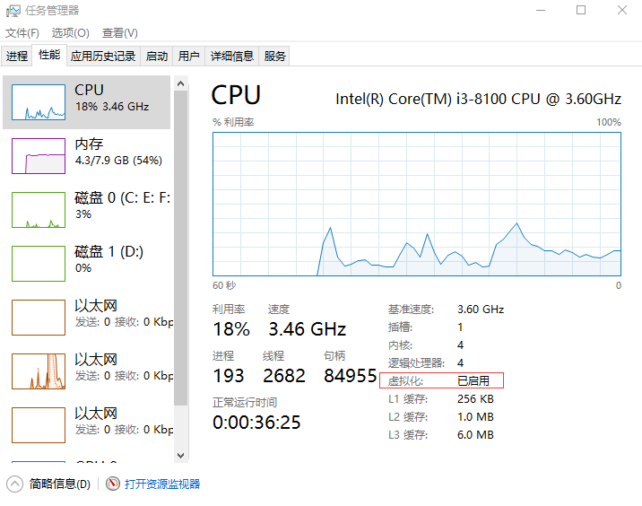
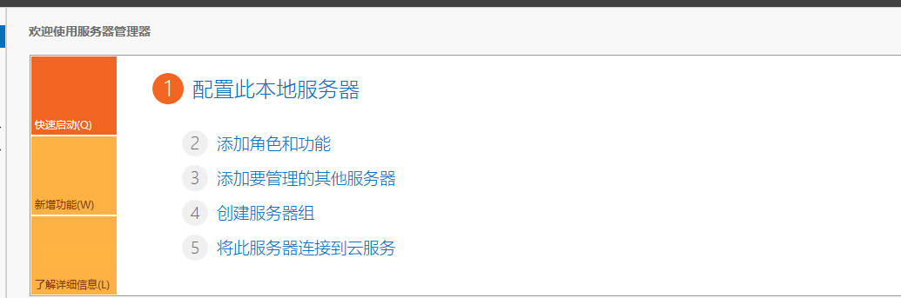
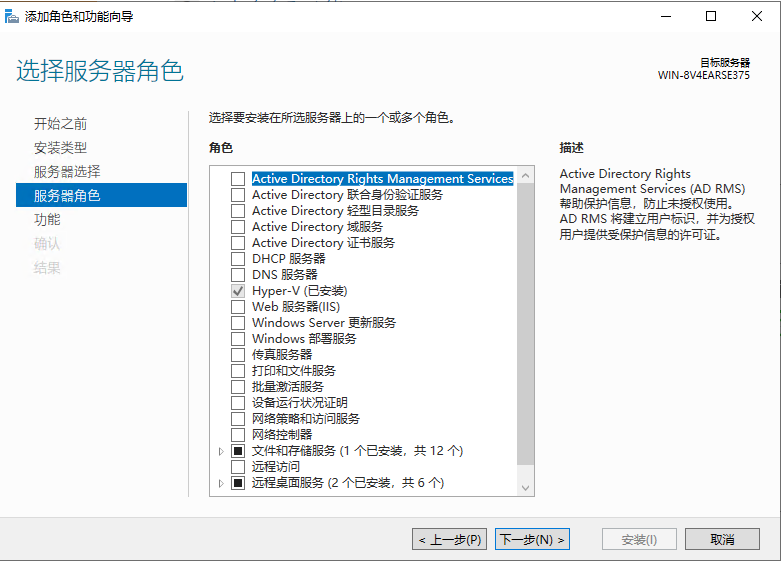
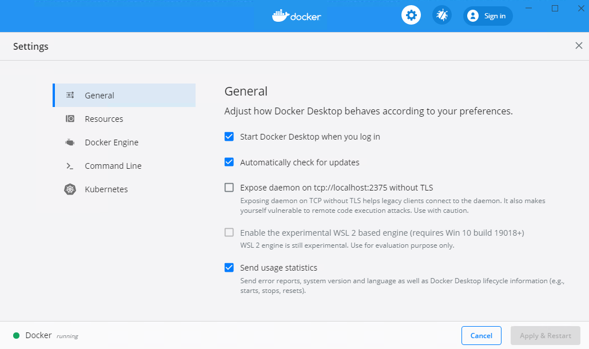
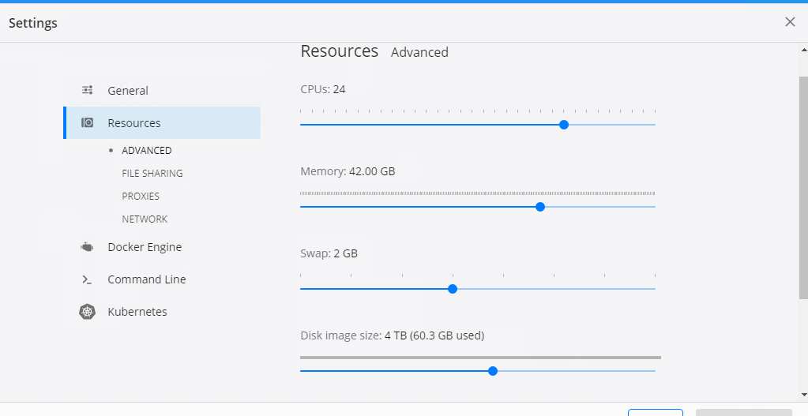
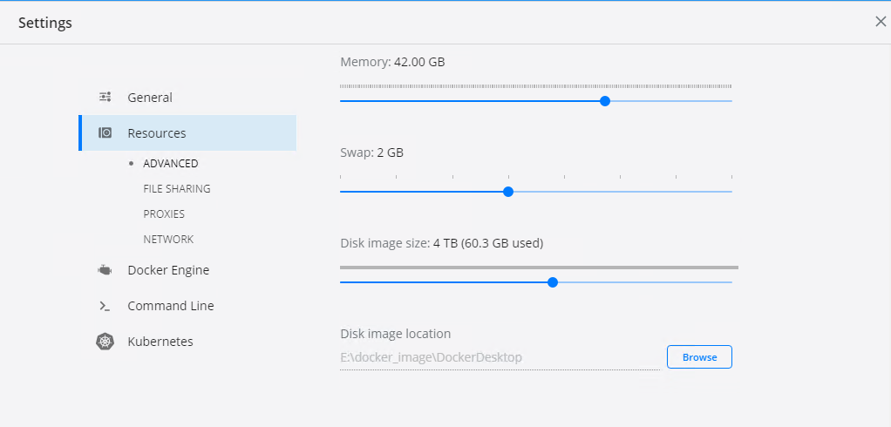
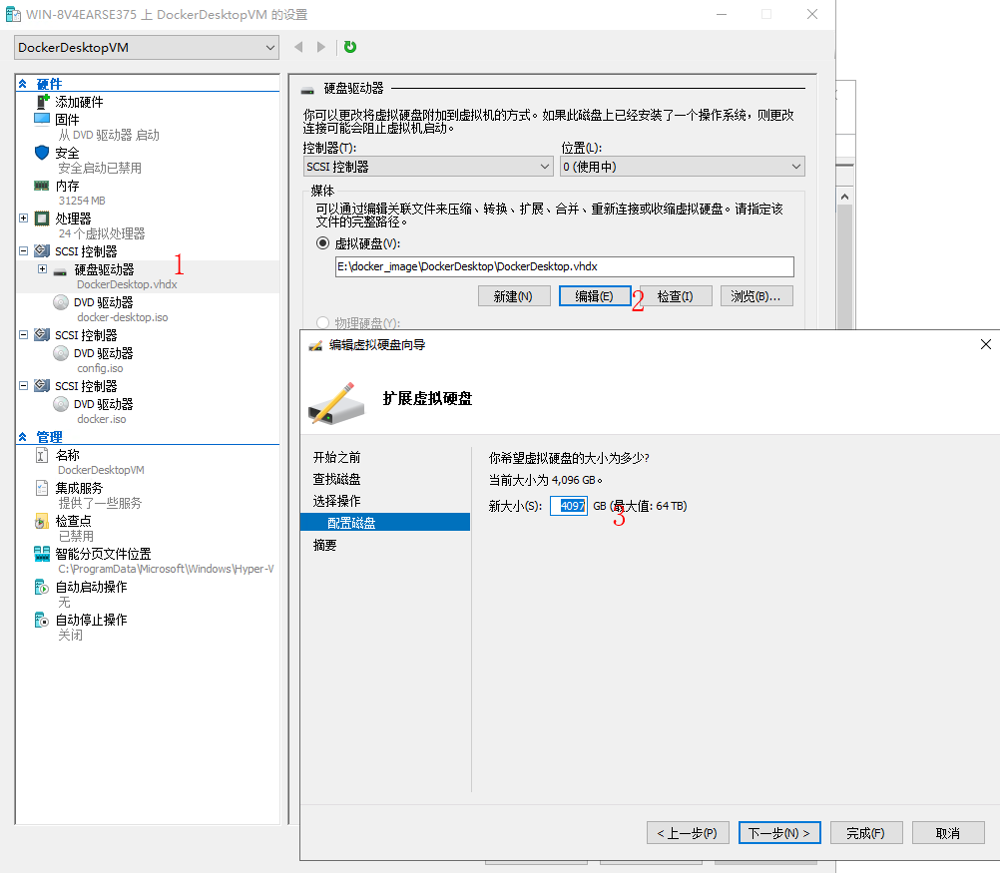
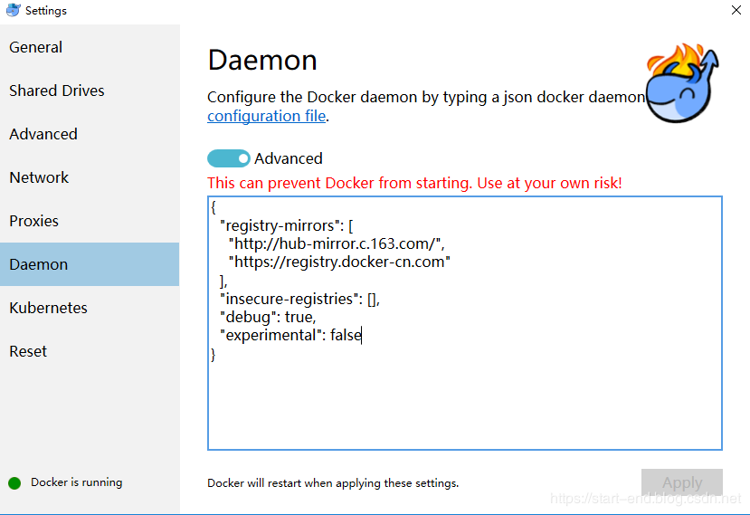

# 使用Docker Desktop搭建编译环境

## 安装Docker Desktop

Docker Desktop for Windows需要运行Microsoft Hyper-V。如果需要，Docker Desktop for Windows安装程序会为您启用Hyper-V，并重新启动计算机。启用Hyper-V后，VirtualBox（这是不支持Hyper-V的Windows上安装Docker Toolbox时候需要运行的虚拟机软件，这里我们默认你的Windows是支持Hyper-V的）不再起作用，但仍保留任何VirtualBox VM映像。创建的VirtualBox VM docker-machine（包括default通常在Toolbox安装期间创建的VM ）不再启动。这些VM不能与Docker Desktop for Windows一起使用。但是，您仍可以使用它docker-machine来管理远程VM。

**系统要求：**
笔者使用的是windows service 2019
在BIOS中启用虚拟化(各个主板的BIOS的操作面板不同，可咨询主板商)。通常，默认情况下启用虚拟化。
具有CPU SLAT功能。
至少4GB的运行内存。
启用Hyper-V
查看是否启用虚拟化：
按住：**Ctrl+Alt+Del** - 打开任务管理器 - 性能选项卡



Hyper-V的启用如下：选择添加角色和功能





下载Docker Desktop安装即可,  运行成功后会有如下界面。




## 配置Docker Desktop

**修改Docker的最大资源和镜像保存的路径**





将Disk image location修改为E:\docker_image\DockerDesktop


**修改Hyper-V的设置**

只修改上面那部分，Docker的镜像大小会被Hyper-V限制为60G，所以需要修改Hyper-v的默认镜像大小

打开Hyper-V管理器


可以看到有一个DockerDesktopVM,  这个每个人的名字都不一样，点击设置


修改路径和大小, 路径保持和之前在Docker Desktop中设置的一致



**配置镜像加速**




## 使用Docker

打开PowerShell， 输入docker info， 可以看到具体信息。

下载ubuntu14.04镜像, 登录https://hub.docker.com/_/ubuntu?tab=tags， 找一个比较新的ubuntu14.04的源即可，找了一个14.04.5的版本:

```
docker pull ubuntu:14.04.5
```

启动一个容器， 映射10010端口到22端口:

```
docker run -d -it -p 10010:22 --restart=always --name test.001 ubuntu:14.04.5 bash
```

现在还无法用ssh登录容器，我们进入容器先修改apt-get源, 修改/etc/apt/source.list文件，直接替换为自己搭建的源

```
deb http://192.168.42.248:8082/ubuntu/14.04/ trusty main restricted universe multiverse 
deb http://192.168.42.248:8082/ubuntu/14.04/ trusty-security main restricted universe multiverse 
deb http://192.168.42.248:8082/ubuntu/14.04/ trusty-updates main restricted universe multiverse 
deb http://192.168.42.248:8082/ubuntu/14.04/ trusty-backports main restricted universe multiverse 
deb http://192.168.42.248:8082/ubuntu/14.04/ trusty-proposed main restricted universe multiverse 
deb-src http://192.168.42.248:8082/ubuntu/14.04/ trusty main restricted universe multiverse 
deb-src http://192.168.42.248:8082/ubuntu/14.04/ trusty-security main restricted universe multiverse 
deb-src http://192.168.42.248:8082/ubuntu/14.04/ trusty-updates main restricted universe multiverse 
deb-src http://192.168.42.248:8082/ubuntu/14.04/ trusty-backports main restricted universe multiverse 
deb-src http://192.168.42.248:8082/ubuntu/14.04/ trusty-proposed main restricted universe multiverse
```

**更新源:**

```
sudo apt-get update
```

**安装ssh：**

```
sudo apt-get install openssh-server
```

**新建启动脚本:**

```
touch /start.sh
vim start.sh
```

**脚本内输入容器启动时需要启动的服务：**

```
#!/bin/sh
/etc/init.d/ssh start
/bin/bash
```

**保存为镜像:**

在容器外执行:

```
docker commit 容器号 ubuntu:ssh
```

**重新启动容器, 设置启动容器时启动start.sh:**

```
docker rm 容器号
docker run -d -it -p 10010:22 --restart=always --name test.001 ubuntu:ssh /start.sh
```

**使用ssh远程容器:**

```
ssh -p 10010 root@ip
```

OK, 大功告成。


## 存在的问题

因为数据全都存储在虚拟盘中，如果Docker有异常之后数据特别容易丢失。


## 优化

挂载硬盘到Docker中


启动容器时使用

```
docker run -d -it -p 10010:22  -v D:/user:/home --restart=always --name test.001 ubuntu:ssh /start.sh
```

这样在容器/home目录下的数据会保存到D:/user中